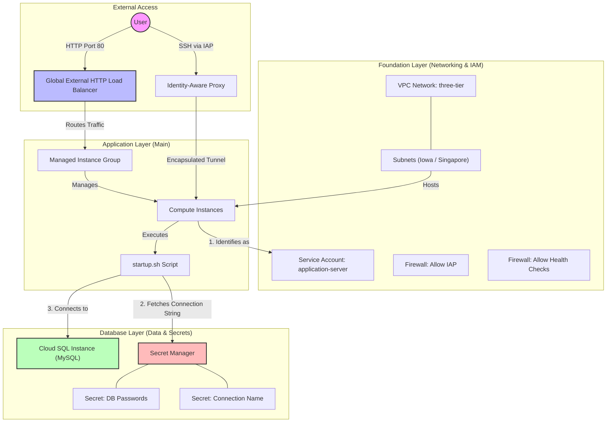

# Chapter 06: Advanced Infrastructure Patterns and Layering

Chapter 06 advances the concepts of scalability and security by introducing a THREE-LAYERED architectural pattern. It demonstrates how to decouple infrastructure components while maintaining secure communication and state sharing.

## Key Concepts

### 1. Multi-Layer Infrastructure Architecture
Instead of one massive configuration, the infrastructure is split into three distinct directories:
- **Foundation**: Networking (VPC, Subnets) and IAM (Service Accounts).
- **Database**: State-heavy resources like Cloud SQL and sensitive secrets.
- **Main (App)**: Compute resources (MIG, Load Balancers) that depend on the other two.

### 2. Practical State Sharing
The chapter builds on Chapter 05's remote state concepts by using `data "terraform_remote_state"` to link layers.
- **Example**: The `main` layer reads the `foundation` layer's remote state to find which subnet to deploy instances into.
- **Key Insight**: Any value defined in an `output` block is persisted in the `.tfstate` file as part of an `outputs` JSON key. The `terraform_remote_state` data source uses this as a "bridge" to securely pass information between decoupled infrastructure layers.

### 3. Native Secrets Management
Introduces **Google Secret Manager** for a "Secret-Zero" approach to security.
- **Storage**: Database passwords and connection strings are stored as Secret Manager versions rather than just Terraform variables.
- **Retrieval**: Instead of injecting secrets directly into the VM metadata (often visible in logs), the VM uses its **Service Account** identity to fetch secrets at runtime.

### 4. Scalable Compute with MIGs
Introduction of **Managed Instance Groups (MIG)** for high availability.
- **Instance Templates**: Separation of *how* an instance is configured from *how many* instances are running.
- **Startup Scripts**: Demonstrates automated configuration (Nginx, MySQL client) and dynamic secret retrieval using the `gcloud` CLI.

## My Insights

- **Blast Radius Reduction**: By separating `foundation` from `app`, you ensure that a mistake in an application update cannot accidentally delete your VPC or database.
- **Identity-Based Security**: The shift from using passwords to using Service Account permissions to *access* passwords (via Secret Manager) is a major security uplift.
- **Infrastructure as a Dependency**: The pattern of referencing the `foundation` layer as a "read-only" data source is a clean way to manage large-scale multi-team environments.
- **Dynamic Runtime Config**: The use of `startup.sh` to fetch the `latest` secret version means you can rotate passwords in GCP without necessarily re-running Terraform, as long as the application is restart-aware.

## Production-Ready Deployment Security

In professional environments, it is a best practice to restrict `terraform apply` permissions for deeper layers (Foundation/Database) while allowing them for the Application layer. This is achieved through:

- **State Bucket IAM Permissions**: Granting `Storage Object Admin` only on the application state path and `Storage Object Viewer` on the foundation/database paths. This provides a "Read-Only" lock on critical infrastructure state.
- **Service Account Impersonation**: Using specific identities (e.g., `Network-Admin-SA` vs. `App-Deployer-SA`) for different layers. Developers can be restricted to only impersonating the application-level identity.
- **CI/CD Pipelines**: Enforcement of the "Golden Path" where manual applies are forbidden. Changes must be peer-reviewed and executed by a pipeline identity after specific team approvals.

### Impact: Blast Radius Reduction
This separation ensures that a mistake or compromise in the **Application Tier** (the most frequently changed layer) cannot accidentally delete or corrupt the **Foundation** or **Database**.

## Architecture Diagram

The following diagram illustrates the three-layered approach and the flow of communication between the components.

---
*Note: This summary is based on the layered structure (`foundation`, `database`, `main`) found in the `chap06` directory of the study guide.*
