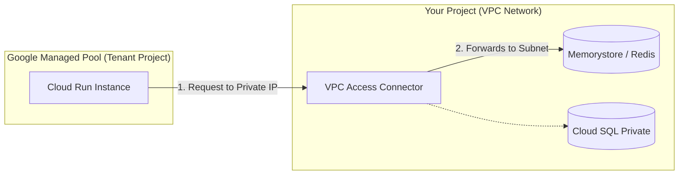
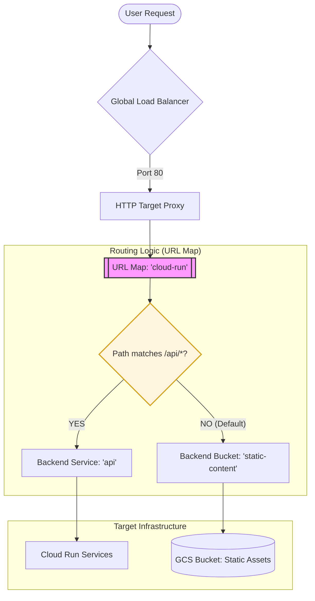

# Chapter 07 Summary: Serverless Architectures and Integration

Chapter 07 shifts the focus from traditional VM-based infrastructure to **Modern Serverless Architectures** using Google Cloud Run. It demonstrates how to build a scalable, multi-layered application that integrates serverless compute with private networking, stateful services, and global traffic management.

## 🚀 Key Learnings

### 1. Cloud Run for Serverless Compute
- **Managed Containers**: Deploying stateless containers without managing servers.
- **Microservices**: Orchestrating multiple services (e.g., `hello` and `redis` services) that interact with each other.
- **Ingress Control**: Using `run.googleapis.com/ingress = "internal-and-cloud-load-balancing"` to restrict access, ensuring traffic only comes from the Load Balancer or internal sources.

### 2. Private Networking for Serverless
- **Serverless VPC Access**: Use of `google_vpc_access_connector` to bridge the gap between serverless platforms (Cloud Run) and private VPC networks.
- **Egress Routing**: Configuring Cloud Run with `run.googleapis.com/vpc-access-egress = "private-ranges-only"` to route traffic to internal IPs (like Redis) while maintaining public internet access for other requests.

### 3. Stateful Serverless with Memorystore
- **Redis Integration**: Provisioning a `google_redis_instance` (Memorystore) within the VPC.
- **Private Connectivity**: Accessing Redis over its private IP from Cloud Run via the VPC connector.
- **Secret Manager**: Securely storing the Redis IP in Secret Manager and injecting it into Cloud Run as an environment variable (`REDIS_IP`).

### 4. Global HTTP Load Balancing (Frontdoor)
- **Serverless NEGs**: Using `google_compute_region_network_endpoint_group` of type `SERVERLESS` to connect Cloud Run services to a Global Load Balancer.
- **Hybrid Backends**: A single URL Map routing traffic to different backends:
    - `/api/*` → Cloud Run (Compute).
    - `Default` → GCS Bucket (Static Content).
- **Global Reach**: Using Forwarding Rules and Target HTTP Proxies to provide a single entry point for the entire stack.

---

## 💡 Insights & Best Practices

### The "Bridge" Pattern (VPC Connector)
One of the most critical learnings is the **Serverless VPC Access Connector**. In GCP, serverless services essentially live "outside" your VPC. To let them talk to private resources like Memorystore or Cloud SQL via private IPs, you **must** create a connector. It acts as a bridge, consuming a `/28` subnet range to route traffic.

### Dynamic vs. Static Split
The integration of **Backend Buckets** and **Serverless NEGs** in one Load Balancer is a powerful architectural pattern. It allows you to:
1. Serve static assets (JS, CSS, Images) directly from GCS (cheap and fast).
2. Serve dynamic requests through Cloud Run.
3. Keep the entire frontend under a single domain name, simplifying CORS and SSL management.

### Security-First Configuration
The chapter emphasizes **Secret Manager** for metadata injection. Instead of hardcoding the Redis IP or passing it as a plain variable, storing it in Secret Manager ensures that sensitive infrastructure details are versioned and access-controlled. 

### Why store the Redis IP in Secret Manager?
1. **Security & Obfuscation**: Prevents sensitive internal infrastructure details (like private IPs) from being hardcoded in container images or visible in plaintext in deployment dashboards.
2. **Dynamic Discovery**: The application (Cloud Run) doesn't need to know the IP at build time. It simply requests the `latest` version of the secret at runtime via the environment variable reference.
3. **Automated Lifecycle**: If the Redis instance is recreated (potentially changing its IP), Terraform automatically updates the Secret Manager value. The application then picks up the new IP on its next container start without requiring code changes or a manual update to environment variables.

### Ingress Hardening
By setting Cloud Run ingress to `internal-and-cloud-load-balancing`, you prevent users from bypassing your Load Balancer and hitting the `.run.app` URL directly. This ensures that features like WAF (Cloud Armor) or CDN (Cloud CDN) enabled on the LB cannot be bypassed.

---

## 🌐 Deep Dive: Serverless Networking Architecture

### The "Two-Project" Model
A fundamental concept in Google Cloud serverless (Cloud Run, Functions) is the separation between management and execution.

- **Customer Project (Your Project)**: Where you define the service, IAM policies, and own the VPC.
- **Tenant Project (Google Managed)**: A hidden project where Google actually spins up the container instances.

### The VPC Access Connector (The Bridge)
Because Cloud Run instances technically live in a different project, they have no native access to your VPC. The **Serverless VPC Access Connector** acts as an encrypted bridge.

### Why this architecture?
1. **Infinite Scaling**: Google handles the massive IP address management required to scale thousands of containers instantly without exhausting your subnet's IP space.
2. **Maintenance-Free Compute**: Google patches and manages the underlying host OS in the Tenant Project without interfering with your VPC configurations.
3. **Security by Default**: Containers are physically isolated from your network until you explicitly open the "connector bridge" and define firewall rules.

---

## 🚦 Deep Dive: The URL Map "Traffic Cop"

The **URL Map** is the brains of the Global Load Balancer. It determines how a single public IP address can serve both static files and dynamic API requests.

### Path-Based Routing Logic
- **`path_rule`**: Captures specific patterns (like `/api/*`) and routes them to high-performance compute backends (Cloud Run via Serverless NEGs).
- **`default_service`**: Acts as a "catch-all." Any request that doesn't match an API path is automatically routed to the GCS Bucket to serve static assets (HTML, images, JS).

### Benefits of the Hybrid Architecture
1. **Unified Domain**: Users access everything via `example.com`, eliminating CORS issues between frontend and backend.
2. **Cost Efficiency**: Static assets are served directly from Object Storage (GCS) at a fraction of the cost of compute.
3. **Operational Simplicity**: A single Global SSL certificate and IP address cover the entire stack.

---

## 🔍 Deep Dive: Dynamic Routing with URL Masks

A critical "Pro Tip" in this chapter is the use of the **`url_mask`** parameter within the Serverless Network Endpoint Group (NEG).

### How it works:
Instead of manually linking every Cloud Run service to the Load Balancer, the NEG uses a pattern-matching string like:
`url_mask = "/api/<service>"`

1. **Extraction**: When a user hits `/api/hello`, the Load Balancer "extracts" the word **"hello"** from the URL.
2. **Dynamic Lookup**: It automatically looks for a Cloud Run service named **"hello"** in the same region and forwards the traffic.

### Why use URL Masks?
1. **Scalability**: One single NEG and one single Backend Service can handle hundreds of microservices.
2. **Zero-Touch Configuration**: Adding a new service (e.g., `inventory`) in Terraform only requires creating the `google_cloud_run_service` resource. The Load Balancer will "discover" it automatically without any code changes to the networking layer.

### The "Contract" Requirement
For this automation to work, there is a strict naming contract: the **URL suffix** must exactly match the **Cloud Run Service Name**. If your service is named `order-processor`, the API endpoint must be `/api/order-processor`.

---
*Summary generated for learning progression in Terraform for Google Cloud Essential Guide.*
