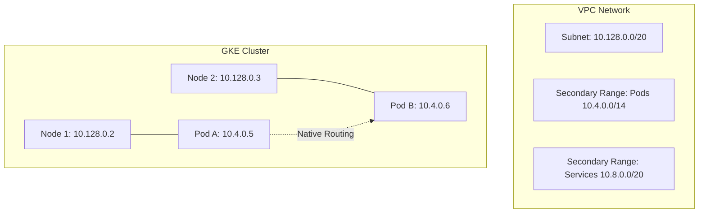

# Chapter 08 Summary: Modernizing with Google Kubernetes Engine (GKE)

Chapter 08 introduces **Google Kubernetes Engine (GKE)** as the primary platform for orchestrating containerized applications. It moves beyond simple VM management into the realm of managed Kubernetes, emphasizing scalability, security, and environment-specific optimizations.

## 🚀 Key Learnings

### 1. GKE Cluster Architecture
- **Managed Control Plane**: Google manages the Kubernetes API server and control plane.
- **Zonal vs. Regional Clusters**: 
    - **Zonal**: Single control plane in one zone (cost-effective for `dev`).
    - **Regional**: Replicated control plane across multiple zones (high availability for `prod`).
- **Autopilot vs. Standard**: While the chapter uses the Standard mode for granular control, it highlights Google's management of node health and upgrades.

### 2. VPC-Native Networking (The Modern Standard)
- **Alias IPs**: Using GKE's native integration with VPC routing via **Secondary IP Ranges**.
- **IP Management**: Dedicating specific `/14` or `/20` ranges for **Pods** and **Services**, separate from node IPs.
- **Low Latency**: Directly routable Pod IPs within the VPC, eliminating the need for complex overlay networks.

### 3. Node Pool Optimization
- **Custom Node Pools**: Separating the default node pool from application-specific pools.
- **Spot VMs**: Using `spot = true` in `dev` environments to significantly reduce costs (up to 60-91%).
- **Autoscaling**: Enabling **Horizontal Pod Autoscaling (HPA)** and cluster autoscaling to handle variable loads.
- **Machine Types**: Tailoring resources (e.g., `e2-small` for `dev`, `e2-standard-2` for `prod`).

### 4. Security & Isolation
- **Least Privilege SA**: Assigning a dedicated, scoped **Service Account** to GKE nodes instead of the default Compute Engine SA.
- **Network Policies**: Enabling internal firewall rules within the cluster to restrict pod-to-pod communication.
- **IAP for Management**: Using **Identity-Aware Proxy (IAP)** for secure SSH access to nodes without public IPs.

---

## 💡 Terraform Insights & Best Practices

### 1. The Power of "Official" Modules
The chapter leverages the `terraform-google-modules/kubernetes-engine/google` module. This simplifies complex GKE deployments by abstracting hundreds of raw resources into a high-level interface.

### 2. Multi-Environment Orchestration
A standout lesson is the use of distinct `.tfvars` files for Environment Management:
- **`dev.tfvars`**: Optimized for cost; uses Zonal clusters and Spot VMs.
- **`prod.tfvars`**: Optimized for reliability; uses Regional clusters and stable instances.

| Feature | Dev Configuration | Prod Configuration |
| :--- | :--- | :--- |
| **Cluster Type** | Zonal | Regional |
| **Node Type** | Spot VMs | Standard VMs |
| **Zones** | 1 Zone | 3 Zones |
| **Autoscaling** | Aggressive | Conservative |

### 3. Dynamic Provider Configuration
To manage resources *inside* Kubernetes (like Namespaces or Deployments) immediately after the cluster is built, Terraform must dynamically configure the `kubernetes` provider:

```hcl
data "google_client_config" "default" {}

provider "kubernetes" {
  host                   = "https://${module.gke.endpoint}"
  token                  = data.google_client_config.default.access_token
  cluster_ca_certificate = base64decode(module.gke.ca_certificate)
}
```
*Note: This pattern ensures that the Kubernetes provider can authenticate to the newly created engine without hardcoded credentials.*

### 4. Service Account Lifecycle
Explicitly defining `create_service_account = false` and passing a custom SA allows for better IAM auditing and prevents the cluster from having "god-mode" permissions over the entire GCP project.

---

## 🔍 Deep Dive: VPC-Native Connectivity

The "VPC-Native" approach is a critical architectural shift. In traditional GKE, pods used a "Routes-based" approach which had scaling limits. VPC-native uses **Alias IPs**, making every Pod a first-class citizen in the network.



### Why does this matter?
- **Hybrid Connectivity**: On-premise systems can reach Pods directly via Interconnect/VPN if advertised.
- **Security Groups**: Cloud Armor and VPC Firewalls can target specific Pod IP ranges.
- **Scalability**: No bottleneck at the VPC routing table, supporting thousands of nodes.

---
*Summary generated for learning progression in Terraform for Google Cloud Essential Guide.*
