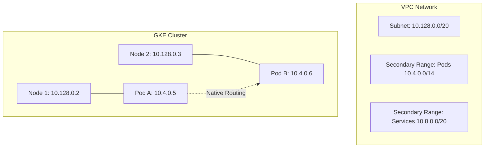

# Chapter 08 Summary: Modernizing with Google Kubernetes Engine (GKE)

Chapter 08 introduces **Google Kubernetes Engine (GKE)** as the primary platform for orchestrating containerized applications. It moves beyond simple VM management into the realm of managed Kubernetes, emphasizing scalability, security, and environment-specific optimizations.

## 🚀 Key Learnings

### 1. GKE Cluster Architecture
- **Managed Control Plane**: Google manages the Kubernetes API server and control plane.
- **Zonal vs. Regional Clusters**: 
    - **Zonal**: Single control plane in one zone (cost-effective for `dev`).
    - **Regional**: Replicated control plane across multiple zones (high availability for `prod`).
- **Autopilot vs. Standard**: While the chapter uses the Standard mode for granular control, it highlights Google's management of node health and upgrades.

### 2. VPC-Native Networking (The Modern Standard)
- **Alias IPs**: Using GKE's native integration with VPC routing via **Secondary IP Ranges**.
- **IP Management**: Dedicating specific `/14` or `/20` ranges for **Pods** and **Services**, separate from node IPs.
- **Low Latency**: Directly routable Pod IPs within the VPC, eliminating the need for complex overlay networks.

### 3. Node Pool Optimization
- **Custom Node Pools**: Separating the default node pool from application-specific pools.
- **Spot VMs**: Using `spot = true` in `dev` environments to significantly reduce costs (up to 60-91%).
- **Autoscaling**: Enabling **Horizontal Pod Autoscaling (HPA)** and cluster autoscaling to handle variable loads.
- **Machine Types**: Tailoring resources (e.g., `e2-small` for `dev`, `e2-standard-2` for `prod`).

### 4. Security & Isolation
- **Least Privilege SA**: Assigning a dedicated, scoped **Service Account** to GKE nodes instead of the default Compute Engine SA.
- **Network Policies**: Enabling internal firewall rules within the cluster to restrict pod-to-pod communication.
- **IAP for Management**: Using **Identity-Aware Proxy (IAP)** for secure SSH access to nodes without public IPs.

---

## 💡 Terraform Insights & Best Practices

### 1. The Power of "Official" Modules
The chapter leverages the `terraform-google-modules/kubernetes-engine/google` module. This simplifies complex GKE deployments by abstracting hundreds of raw resources into a high-level interface.

### 2. Multi-Environment Orchestration
A standout lesson is the use of distinct `.tfvars` files for Environment Management:
- **`dev.tfvars`**: Optimized for cost; uses Zonal clusters and Spot VMs.
- **`prod.tfvars`**: Optimized for reliability; uses Regional clusters and stable instances.

| Feature | Dev Configuration | Prod Configuration |
| :--- | :--- | :--- |
| **Cluster Type** | Zonal | Regional |
| **Node Type** | Spot VMs | Standard VMs |
| **Zones** | 1 Zone | 3 Zones |
| **Autoscaling** | Aggressive | Conservative |

### 3. Dynamic Provider Configuration
To manage resources *inside* Kubernetes (like Namespaces or Deployments) immediately after the cluster is built, Terraform must dynamically configure the `kubernetes` provider:

```hcl
data "google_client_config" "default" {}

provider "kubernetes" {
  host                   = "https://${module.gke.endpoint}"
  token                  = data.google_client_config.default.access_token
  cluster_ca_certificate = base64decode(module.gke.ca_certificate)
}
```
*Note: This pattern ensures that the Kubernetes provider can authenticate to the newly created engine without hardcoded credentials.*

### 4. Service Account Lifecycle
Explicitly defining `create_service_account = false` and passing a custom SA allows for better IAM auditing and prevents the cluster from having "god-mode" permissions over the entire GCP project.

---

## 🔍 Deep Dive: VPC-Native Connectivity

The "VPC-Native" approach is a critical architectural shift. In traditional GKE, pods used a "Routes-based" approach which had scaling limits. VPC-native uses **Alias IPs**, making every Pod a first-class citizen in the network.



### Why does this matter?
- **Hybrid Connectivity**: On-premise systems can reach Pods directly via Interconnect/VPN if advertised.
- **Security Groups**: Cloud Armor and VPC Firewalls can target specific Pod IP ranges.
- **Scalability**: No bottleneck at the VPC routing table, supporting thousands of nodes.

---

## 🔢 Deep Dive: Understanding GKE CIDR Ranges

In a VPC-native cluster, networking is split into three distinct pools. The sizing of these ranges determines the ultimate scale of the cluster.

### 1. Nodes Range (e.g., `10.128.0.0/20`)
- **Purpose**: Internal IPs for the Compute Engine VMs (Nodes) themselves.
- **Capacity**: A `/20` provides **4,096 IPs**.
- **Insight**: Provides headroom for autoscaling and "surge" nodes during rolling upgrades.

### 2. Pods Range (e.g., `10.4.0.0/14`)
- **Purpose**: A secondary range used exclusively for Kubernetes Pods.
- **Capacity**: A `/14` provides **262,144 IPs**.
- **The "Per-Node" Reservation**: By default, GKE reserves a `/24` (256 IPs) per node for its pods. A `/14` total range therefore supports a maximum of **1,024 nodes**.
- **Insight**: This is typically the largest range because Pods are the most numerous and ephemeral resources.

### 3. Services Range (e.g., `10.8.0.0/20`)
- **Purpose**: Used for Kubernetes Services (ClusterIPs/Internal Load Balancers).
- **Capacity**: A `/20` provides **4,096 IPs**.
- **Insight**: Most applications have fewer "entry points" (Services) than running instances (Pods), so this range can be smaller.

---

## 🛠️ Terraform Pro-Tip: `optional()` vs. `default`

In modern Terraform (1.3+), using `optional()` inside an `object` type is the preferred way to handle complex resource configurations like GKE node pools.

### Why use `optional()`?
- **Granular Overrides**: Users can override just a single field (e.g., changing only `spot = false`) without being forced to provide the entire object.
- **Efficient Defaults**: Terraform performs a **deep merge**. It uses the values provided by the user and automatically fills in the missing pieces from your defined defaults.
- **Cleaner Code**: Results in much smaller and more readable `.tfvars` files, as they only need to contain what is *different* from the standard configuration.

### Comparison
| Feature | Standard `default` | `optional()` |
| :--- | :--- | :--- |
| **Override Level** | Whole Object (All-or-nothing) | Per-field (Partial) |
| **TFVars File** | Verbose & Redundant | Concise & Focused |
| **Use Case** | Simple types (string, bool) | **Complex Objects (Clusters, VPCs)** |

---

## 📦 Why Use Modules for Complex Resources (like GKE)?

Using the official GKE module instead of declaring individual resources offers three major technical benefits:

### 1. Abstraction (The "Single Artifact")
Instead of managing dozens of individual resources (APIs, clusters, node pools, IAM roles), a module provides a high-level interface. This reduces boilerplate and lets you focus on architectural variables rather than raw resource definitions.

### 2. Built-in Dependency Management
GKE has complex dependency requirements (e.g., APIs must be enabled before clusters, clusters must be healthy before node pools, IAM must be ready before nodes). Modules contain the internal logic to handle these sequences correctly in the Terraform dependency graph.

### 3. Namespacing and Organization
In Terraform state, every resource created by a module is prefixed with that module's name (e.g., `module.gke.*`). This prevents name collisions and allows you to call the same module multiple times (e.g., for `dev` and `prod`) within the same environment if needed.

---

## 🔐 Deep Dive: The Cluster CA Certificate

In the `gke.tf` file, you'll see a reference to `module.gke.ca_certificate`. This is the **Root Certificate Authority (CA)** for the entire cluster.

### What is its role?
- **Foundation of Trust**: It allows your local machine (or Terraform) to verify that the GKE API server it's talking to is authentic and hasn't been intercepted (Man-in-the-Middle protection).
- **Secure Handshake**: It ensures the SSL certificate presented by the cluster endpoint is legitimate before any sensitive data (like authentication tokens) is sent.

### Why is it handled as "Sensitive"?
- **Identity Protection**: While it isn't a password, an attacker with the CA certificate could potentially spoof your cluster's identity to steal credentials from unsuspecting clients.
- **Defense in Depth**: We treat it as sensitive in Terraform outputs and store it in **Secret Manager** to ensure that access is audited, versioned, and restricted to only the necessary personnel or systems.

---
*Summary generated for learning progression in Terraform for Google Cloud Essential Guide.*
